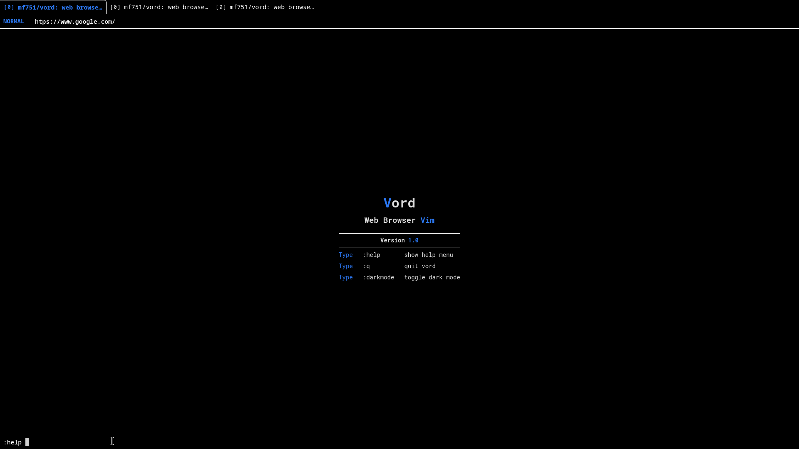

# **Vord**
**vim as a web browser**
## **Features**

## Todo
- link hinting keybinds with confermation
- tabs
- navigation
- bookmarks
- modes
- commands
- history
- donwload manager
- config file
- ad blocking
- extenstions
- macros
- focus mode

## Demo

